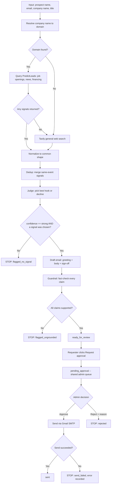

# Process Map — PS-3: Personalised Outreach

*Input → each stage → decision points → output, mapped before (and now reflecting) the build.*

## One-line summary

**Input**: a prospect's name, email, and company (+ optional title)
**Output**: either a sent email (after two separate humans explicitly agree),
a rejected draft with a stated reason, or an honest "nothing qualified" —
never a forced, generic email, and never a single-click send.

## The flow

## Stage-by-stage

### 1. Intake
- **Input**: `{prospect_name, prospect_email, company_name, title}` typed into the form.
- **What happens**: a new record is created under the logged-in account, status `pending`.
- **Decision point**: none — this stage can't fail or branch.
- **Output**: a run ID, immediately handed to stage 2.

### 2. Research
- **Input**: `company_name`.
- **What happens**: resolve the name to a real domain (live search), then pull job openings, news, and financing events for it. No domain, or nothing returned? Fall back to a general web search rather than coming back empty.
- **Decision point**: *is there a usable domain, and did the structured API return anything?* If either answer is no, fall back to a general web search.
- **Output**: a list of raw signals, each with a source, type, title, snippet, date, and URL.
- **Known failure mode**: a generic/ambiguous company name can pull a signal about a *different, unrelated* company that happens to share a word (seen with "Apex Labs" vs. "Apex Systems") — not caught here, caught downstream by the guardrail (stage 7).

### 3. Normalize
- **Input**: raw signals in multiple shapes (one per source/dataset).
- **What happens**: every signal is mapped onto one common shape so later stages don't need to know where it originated.
- **Decision point**: none — pure data transformation.
- **Output**: a uniform list of signals, each with a stable ID (`s1`, `s2`, ...).

### 4. Dedup
- **Input**: the normalized signal list.
- **What happens**: signals describing the same underlying event (same ~3-week window + overlapping title keywords) are merged into one.
- **Decision point**: *do two signals describe the same event?* If yes, merge; if no, keep separate.
- **Output**: a deduplicated signal list.

### 5. Judgment *(decision point 1)*
- **Input**: the deduplicated signals + today's real date + what we're pitching.
- **What happens**: picks the single best signal as a hook, or explicitly declines.
- **Decision point**: does any signal (a) connect plausibly to an operations/efficiency pain point, (b) remain within a ~90-day freshness window, and (c) not require forcing a weak connection? If no signal clears all three, the process stops here on purpose.
- **Output**: `{confidence: strong, chosen_signal_id: ...}` → continue, or `{confidence: weak}` → **stop, `flagged_no_signal`.**

### 6. Draft
- **Input**: the one chosen signal.
- **What happens**: writes a complete email — greeting (prospect's first name only), a 3-5 sentence body built around the signal, and a mandatory "Best regards, / Team Zamp" sign-off, each part on its own line.
- **Decision point**: none at this stage — the real check happens next.
- **Output**: a draft subject + body + which signal(s) it claims to cite.

### 7. Guardrail *(decision point 2)*
- **Input**: the draft body + the signal(s) it cited.
- **What happens**: a *separate, independent* pass extracts every factual claim from the draft and checks each against the actual source text.
- **Decision point**: is every claim actually supported? If even one isn't, the draft doesn't get marked safe to send.
- **Output**: `all_supported: true` → **`ready_for_review`**, or `all_supported: false` → **stop, `flagged_ungrounded`.** Fired twice in real testing — once catching a numeric conflation, once an entity mix-up (the Apex Labs/Apex Systems case from stage 2).

### 8. Request approval *(human action 1)*
- **Input**: a `ready_for_review` run with a `prospect_email` on file.
- **What happens**: the requester reviews the draft themselves and explicitly clicks "Request approval to send."
- **Decision point**: *is there actually an email to send to?* No `prospect_email` → the button doesn't even appear.
- **Output**: status `pending_approval`, now visible in the **shared** admin queue — not scoped to any one user.

### 9. Admin review *(human action 2, decision point 3)*
- **Input**: every `pending_approval` run across all accounts, newest first.
- **What happens**: a second person (any logged-in account by default, or an allowlisted admin if `ADMIN_DASHBOARD_ACCESS=admin_only`) opens the preview pane and decides.
- **Decision point**: approve, or reject with a required typed reason — there is no third option, and rejection without a reason is blocked both client- and server-side.
- **Output**: **Approve** → attempt a real send. **Reject** → stop, status `rejected`, reason stored and shown back to whoever requested it.

### 10. Send
- **Input**: the approved draft's subject, body, and `prospect_email`.
- **What happens**: `app/email_sender.py` sends it for real via Gmail SMTP, run off the main event loop (`asyncio.to_thread`) since SMTP is blocking I/O.
- **Decision point**: did the send succeed?
- **Output**: success → `sent`. Failure (bad credentials, SMTP error) → `send_failed`, with the exact error recorded and shown in the UI rather than disappearing silently.

## Where a run can land

| Status | What it means |
|---|---|
| `ready_for_review` | Grounded draft, not yet requested for approval |
| `flagged_no_signal` | Nothing cleared judgment — stale, irrelevant, or absent |
| `flagged_ungrounded` | A claim in the draft wasn't actually supported |
| `pending_approval` | Requester asked; waiting on a second person |
| `sent` | Approved and actually emailed |
| `rejected` | A second person declined, with a stated reason |
| `send_failed` | Approved, but the actual SMTP send failed |

## Why the two extra human steps matter as much as the two AI decision points

The original pipeline (stages 1-7) is designed to **stop and explain rather
than guess** — that was the core design principle from day one. Stages 8-10
extend the same principle to the human side: no single click sends an email.
One person has to say "this is worth sending," a *different* person has to
say "I agree, send it" — and if they don't agree, they have to say why,
instead of a silent no. The AI's job ends at producing something worth
reviewing; it was never going to be the AI's job to also authorize sending it.
